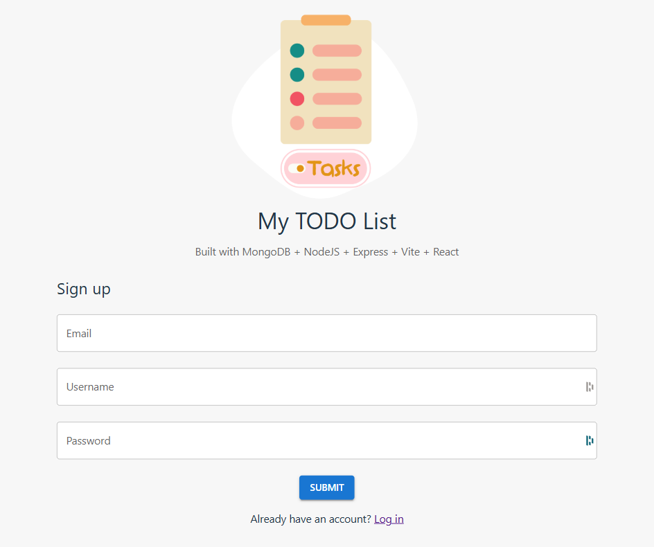
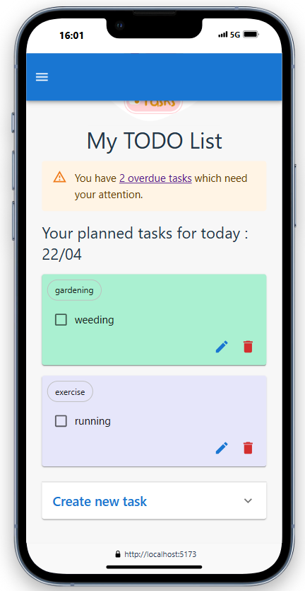

# My TODO List App - MERN stack application 

This project is a full-stack application built with `MongoDB, Express, React and Node.js`. 
The purpose of this project is to serve as a training to get familiar with those technologies.

## Features
### Users can Sign Up or Log in



### Users can only view and modify their own tasks




### Future imrpovements
- [ ] Add a date of completion to Task and highlight when a Task is overdue
- [ ] Improve the Task view to show tasks per date
- [ ] User can create a category and assign it to its tasks
- [ ] User is then after to filter the Task views per category

## Backend

### Prerequisites
Provide in the `.env` the MongoDB uri and a JWT secret for JWT generation

```
MONGO_URI=
JWT_SECRET=
```

### Installation and Setup Instructions

You will need `node` and `npm` installed globally on your machine.

Move to frontend folder:
`cd ./backend`

Installation:

`npm install`


To Start Server:

`npm start`

Server is running on PORT:

`http://localhost:8080/`

## Frontend

### Prerequisites
Provide in the `.env` the backend url.

```
VITE_BACKEND_API_URL=http://localhost:8080
```

### Installation and Setup Instructions

You will need `node` and `npm` installed globally on your machine.

Move to frontend folder:
`cd ./frontend`

Installation:

`npm install`


To Start Server:

`npm run dev`

To Visit App:

`http://localhost:5173/`

### Acknowledgement
This project took string inspiration from the following resources :
- https://www.freecodecamp.org/news/how-to-build-a-mern-stack-to-do-app/
- https://www.freecodecamp.org/news/how-to-secure-your-mern-stack-application/
- https://medium.com/@neelriteshyadav/setting-up-protected-routes-in-a-mern-stack-application-a51c37a53762
