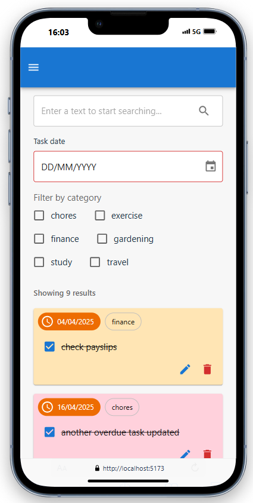

# My TODO List App - MERN stack application 

> Please note that this **Project is under construction** 

This project is a full-stack application built with `MongoDB, Express, React and Node.js`. 
The purpose of this project is to serve as a training to get familiar with those technologies.

## Features
### User can Log in


### User can only view and update their own tasks


### User can create new tasks


### User can create a new category of task


### User view all tasks and filter results



### Ongoing improvements
- [x] ~~replace Navigation with AppBar to be able to add more menu item~~
- [ ] Category management (when updating a category on DocumentDB the change should propagate)
- [ ] Fix slight flickering on All tasks page --> use createApi() from RTK query to optimise number of calls
- [ ] Add unit test and e2e testing

## Backend

### Prerequisites
Provide in the `.env` the MongoDB uri and a JWT secret for JWT generation

```
MONGO_URI=
JWT_SECRET=
ALLOWED_ORIGIN=
DOMAIN=
NODE_ENV=
```

- For `ALLOWED_ORIGIN` specify the frontend url, example : `ALLOWED_ORIGIN=http://localhost:5173`
- For `DOMAIN` (optional), use this in deployed env, specify the domain example : `DOMAIN=mywebsite.com`
- For `NODE_ENV`, specify value `development` or `production`

### Installation and Setup Instructions

You will need `node` and `npm` installed globally on your machine.

Move to frontend folder:
`cd ./backend`

Installation:

`npm install`


To Start Server:

`npm start`

Server is running on PORT:

`http://localhost:8080/`

## Frontend

### Prerequisites
Provide in the `.env` the backend url.

```
VITE_BACKEND_API_URL=http://localhost:8080
VITE_DOMAIN=
VITE_NODE_ENV=
```

- For `VITE_BACKEND_API_URL` specify the backend url.
- For `VITE_DOMAIN` (optional), use this in deployed env, specify the domain example : `VITE_DOMAIN=mywebsite.com`
- For `VITE_NODE_ENV` (optional), specify value `development` or `production`

### Installation and Setup Instructions

You will need `node` and `npm` installed globally on your machine.

Move to frontend folder:
`cd ./frontend`

Installation:

`npm install`


To Start Server:

`npm run dev`

To Visit App:

`http://localhost:5173/`

### Acknowledgement
This project took strong inspiration from the following resources :
- https://www.freecodecamp.org/news/how-to-build-a-mern-stack-to-do-app/
- https://www.freecodecamp.org/news/how-to-secure-your-mern-stack-application/
- https://medium.com/@neelriteshyadav/setting-up-protected-routes-in-a-mern-stack-application-a51c37a53762
